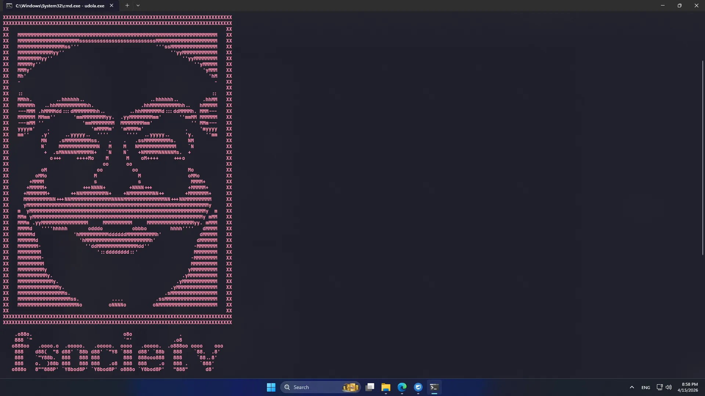

# Stress-Test-Layer7-DoS-
A Layer 7 stress testing tool written in Go. Supports multi-threading and proxy integration for load testing and security research.

# Udola - Layer 7 Stress Testing Tool

A lightweight and efficient HTTP load testing tool developed in Go, designed for security researchers and developers to evaluate web server resilience.

## 🛠 Features
- **Multi-threading:** High-performance concurrent requests.
- **Easy to use:** Simple CLI interface for rapid testing.
- **Proxy Support:** `udola2.go` comes with built-in free proxy integration for distributed testing scenarios.

## 🚀 Installation & Usage

Ensure you have [Go](https://go.dev/dl/) installed on your system.

### Basic Version
1. Run the script:
   ```bash
   go run udola.go
   or
   go run udola2.go

# IMG

<p align="center">
  
</p>
